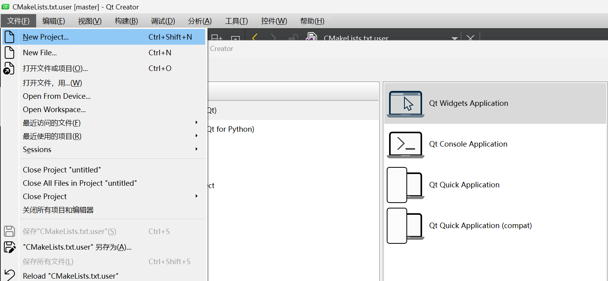
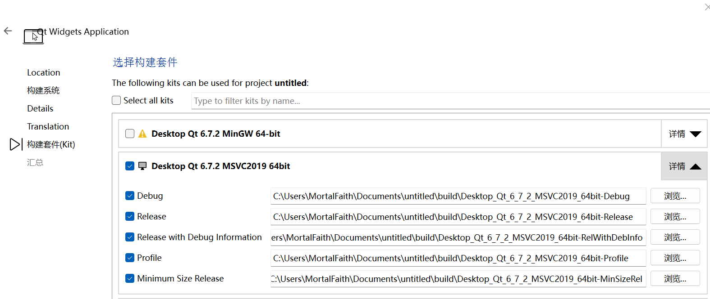

# 计算机图形学（肯定是）

0. 本教程稍显麻烦的原因在于QtCreater创建时会生成一个build文件夹，我们把它gitignore掉了，麻烦的部分在于怎么在本地重新创建这个build文件夹出来
1. 打开QtCreater，它应该在你安装Qt的时候一起安装了。
2. 左上角创建新的项目，选择默认的第一个项目即可。
3. 创建过程中选择合适的创建路径，注意“构建套件“这步选择MSVC版（如出现黄色感叹号可以鼠标移动上去显示报错原因）
4. 创建完成后，另外新建一个文件夹，将[excalibare/CG_Qt_Ver](https://github.com/excalibare/CG_Qt_Ver)的code保存至本地，可以手动下载，不过个人推荐使用SourseTree（git图形化界面，百度即可获取）克隆
5. 将其中[excalibare/CG_Qt_Ver](https://github.com/excalibare/CG_Qt_Ver)的所有代码拷贝至QtCreater创建的项目中（会替换掉原有的三个文件）
6. 此时应该可以在QtCreater中运行，之后使用你喜欢的方法管理QtCreater创建项目的那个文件夹即可
7. 文件编码请选择GBK

